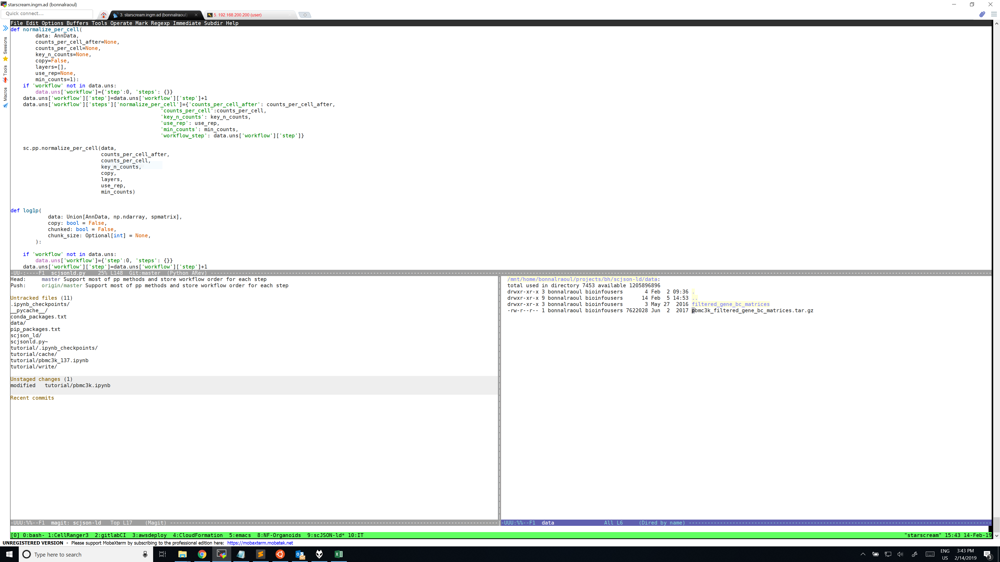
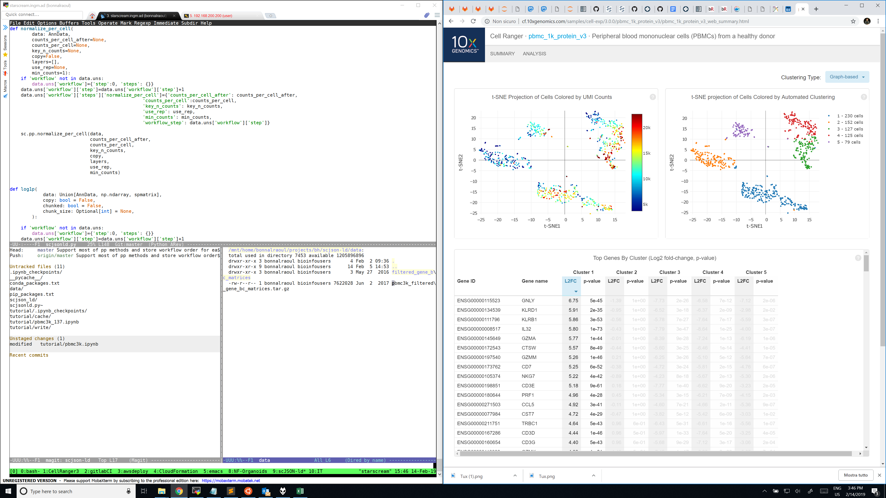
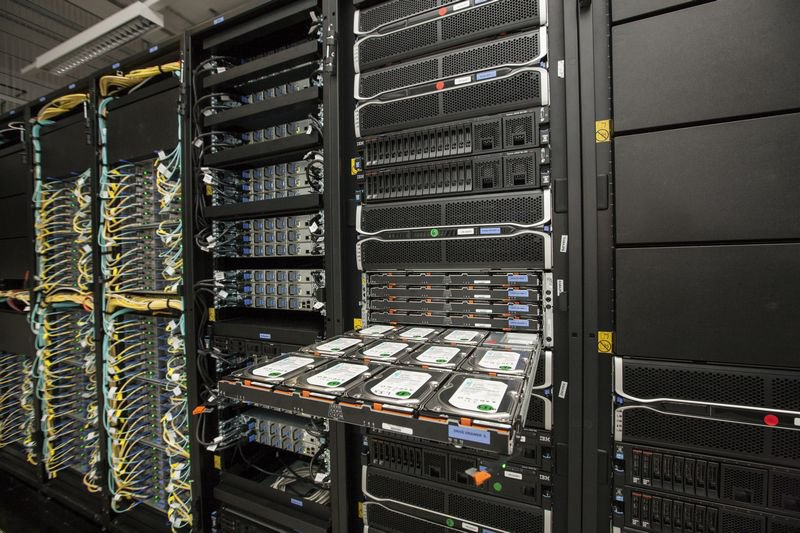
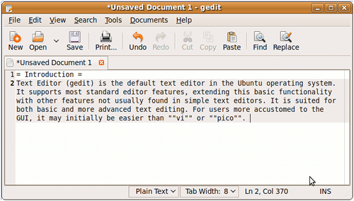
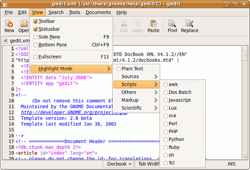
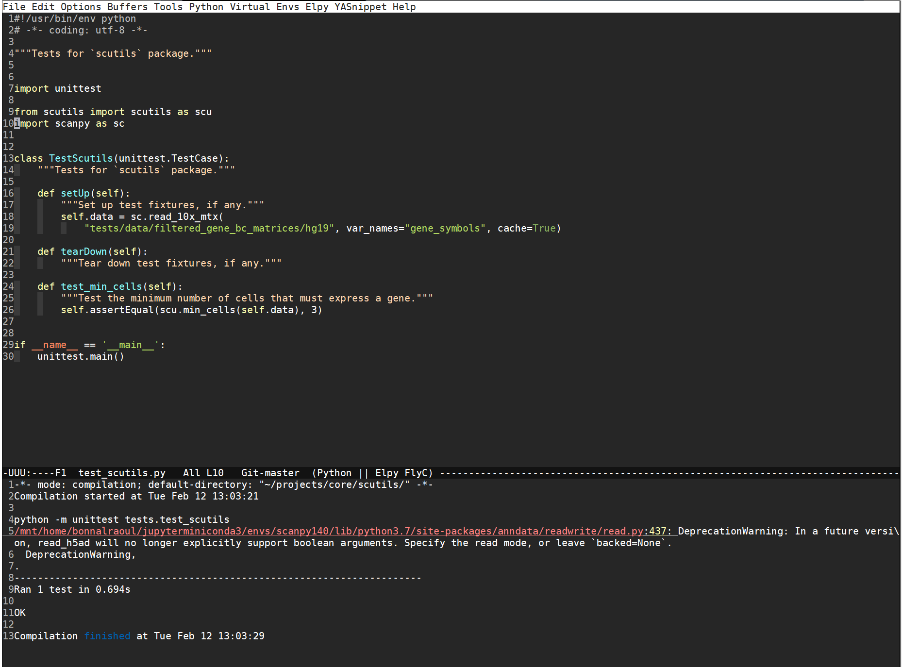

# Tools

*  data
*  software
*  computer


# Tools

*  data
*  *software*
*  computer


# Data

Can change over time (months or years)

# Data

| Freeze d. | GENCODE | Release d. | Genome v.     | UCSC version |
|-----------|---------|------------|---------------|--------------|
|    5.2018 |      29 |    10.2018 | GRCh38        | 29 (GRCh38)  |
|    6.2014 |      21 |    10.2014 | GRCh38        | -            |
|    7.2013 |      19 |    12.2013 | GRCh37        | 19 (GRCh37)  |
|    7.2011 |      10 |    12.2011 | GRCh37        | 10           |
|   12.2010 |       7 |     4.2011 | GRCh37        | 7            |
|    7.2009 |      3c |     9.2009 | NCBI36/GRCh37 | 3c (NCBI36)  |

# Custom dataset

You can even build your own reference genome(s)

* unkown species
* unkown genes
* ...


# Incoming data

Your lab can generate data over time

and 

you must re-analyze it multiple times or combining it in many ways

# Tools

*  data
*  *software*
*  computer


# Software

They transform data

# Software
Each transformation has an input and an output

# Software

The output of the previous transformation is the input for the next one

# Software 

There are many tools for many purposes and our duty is to combine them in a proper way

# Software

* Operating System (OS)
* Applications
* Bioinformatics Applications


# Software: OS

Linux


# OS


# OS

- Linux is open source

Its core code can be inspected and you can contribute !

[torvalds/linux](https://github.com/torvalds/linux)


# OS

- Linux is open source

It is a very very stable system

Our cluster uptime is about Years


# OS

| Source | Date   |  Unix | Windows | Unkw |
|--------|--------|-------|-----------|------|
| W3Tech | Feb 15 | 36.85 |      32.3 | 30.5 |
| W3Tech | Feb 19 |  69.3 |      30.7 |    0 |

[W3Tech](https://w3techs.com/technologies/overview/operating_system/all)

# OS

- Standalone or Remote

You can install Linux main OS or access a remote machine by network


# OS




# OS




# OS

- Multi user
  * Disk 
  * Memory
  * CPU 

Most of the time you share resources with others


# OS

- Multi user
  * Disk ( HDD: long term storage )
  * Memory ( RAM: volatile )
  * CPU ( engine )

Most of the time you share resources with others


# OS

- Cluster of thousands of machines




# OS

- Open Source
- Standalone or Remote
- Multi User
- Cluster of thousands of machines
- Stable
- Huge communities


# Software: Applications

Whatever action you are doing through a computer you are going to use a software somewhere


# Applications

In any case we have 2 best friends:

- An Interface
- An Editor


# Interfaces

- Graphical User Interface
- The ugly terminal


# Interfaces

- Graphical User Interface (ICONS !!!! Mouse !!!!)
- The ugly terminal 


# Interfaces

- Graphical User Interface 
- The ugly terminal 


# Interfaces

The winner is ?


# Interfaces


# Terminal

You can instruct the machine to do whatever you want using the keyboard typing commands.


# Editor




# Editor




# Terminal

With the terminal you can even write documents, text files.

NOT WORD FILES!!!




# The Bash

It is a shell which interprets your commands and acts appropriately

* you will love it


# The Bash

It is a shell which interprets your command and act appropriately

* you will hate it


# The Bash

```
ls -la
```


# The Bash

```
ls -l /root
```

# The Bash

Write a file called "myfile.txt" with `gedit` and read it with the terminal

```
cat myfile.txt
```


# The Bash

Copy a file

```
cp myfile.txt myfile.backup.txt
```
now do a `ls`


# The Bash

Move a file aka Rename

```
mv myfile.txt MyFile.txt
```
now do a `ls`


# The Bash

Connect to your own machine

```
ssh user@localhost
```

if you get a message like this:

```
The authenticity of host 'localhost (::1)' can't be established.
ECDSA key fingerprint is SHA256:Zf595J6gKYjVYVD3R/E1AnQmsLu7QB+Ff1kmBn7vdKo.
Are you sure you want to continue connecting (yes/no)?
```
Type `yes`


# The Bash

Connect to a server

```
ssh user@192.168.200.213
```

now list all the connected users

```
who
```

There are many users all w/the same name 


# The Bash

Using applications
```
STAR --help
```

# Installing programs

The functionalities of a computer can be extended installing software


# Installing programs

1.  Ubuntu/Debian packages [list](https://packages.ubuntu.com/bionic/) or `apt search`
2.  [Conda](https://conda.io) packages. [search](https://anaconda.org/) or `conda search`
3.  [Linuxbrew](http://linuxbrew.sh/). [List](http://formulae.brew.sh/) or `brew search`
3.  From specialized archives: e.g. `pip`
4.  Compile the program


# Ubuntu packages

*  Lots of packages ready `apt-get install ne`
*  Very robust
*  Additional packages with PPAs `add-apt-repository ppa:user/ppa-name`
   *  Not very useful for science


# Advantages

*  Safe and efficient
*  Easy to rebuild from source


# Cons

*  Sometimes outdated (Ubuntu LTS are released every 2 years)


# Conda packages

*  Must be downloaded and installed (with bash)
*  Relies on channels
   *  *[base](https://conda.io/en/latest/)* with installation
   *  *[bioconda](https://bioconda.github.io/)*: bioinformatics programs
   *  *[conda-forge](https://conda-forge.org/)*: misc programs
*  Not very robust/stable


# Advantages

*  Programs are usually the latest version


# Cons

*  Needs update to config files (`~/.bashrc`)
*  Weird interactions with system programs/libraries
*  Messes up with `$PATH` (e.g. shebang)


# Linuxbrew packages

*  Must be downloaded and installed
*  Only one source of packages
*  Similar to conda
   *  fewer packages


# Conda

On our system is already installed by the procedure is quite easy if you start from scratch.

# Conda

You can start creating a conda environemnt.

# Conda

A conda environment let's you install and use software *softly separated* by the original system 
```
conda create -n unimiPhD
```

# Bioinformatic Applications

Then you are ready to install the application for RNA-seq


# Bioinformatic Applications

```
conda install -y -c bioconda \
                 fastqc=0.11.8 \
                 trimmomatic=0.38 \
                 samtools=1.9 \
                 star=2.6.1b
```

# Tools

*  data
*  software
*  *computer*

# Computer

* Local
* Remote
* Physical
* Virtual
* Cloud
