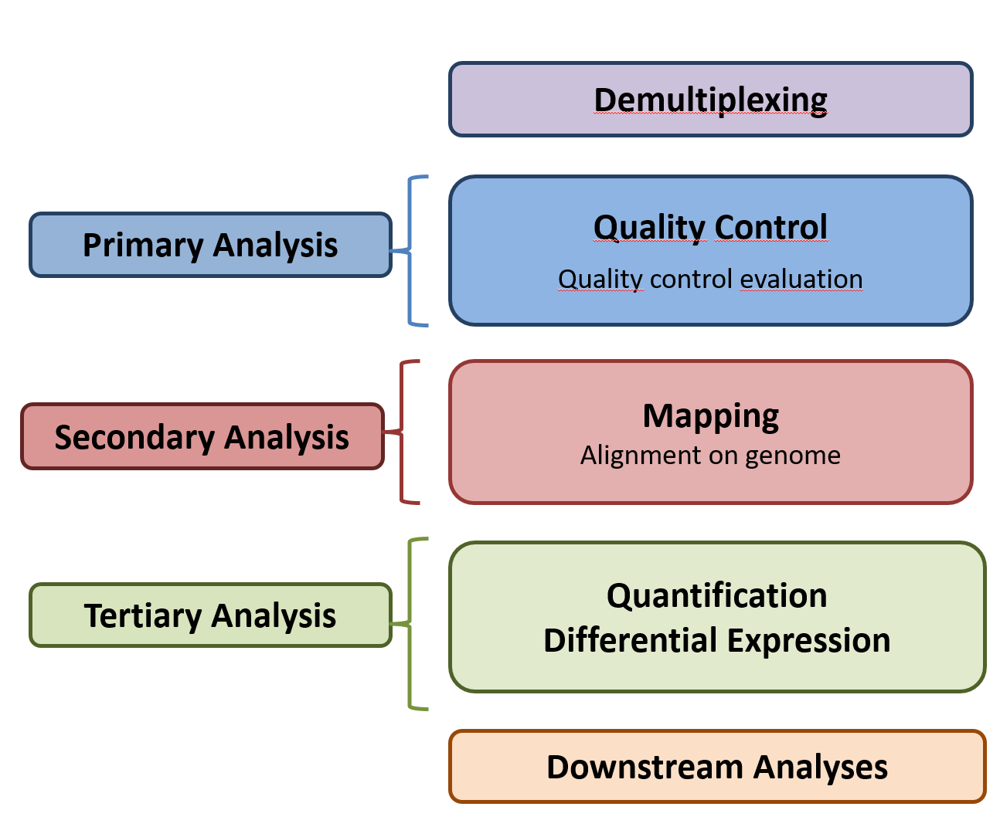
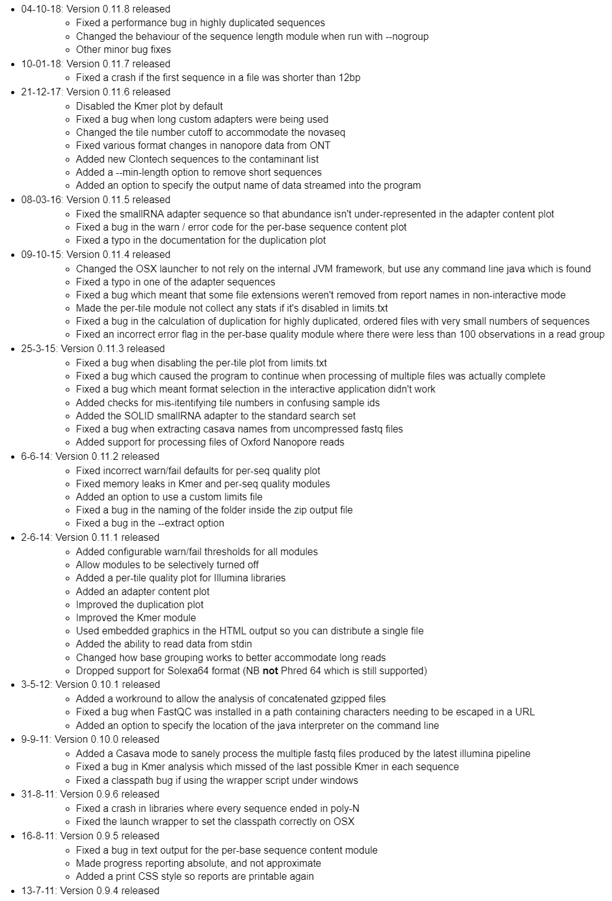
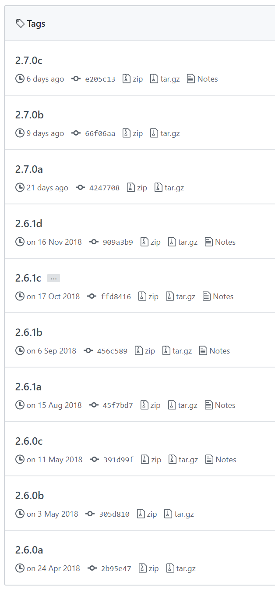

# RNA-seq pipeline

1. Assess reads quality (QC)
2. Clean reads from noise
3. Map reads agains the reference genome
4. Visualize/Manipulate aligned reads
5. Post process

# RNA-seq pipeline



# QC

](img/fastqc.png)

# QC

 

# Clean

](img/trimmomatic.png)


# Mapping

 ](img/star.png)

# Mapping


# Visualize/Manipulate

Create index from BAM w/ ](img/samtools.png)

# Visualize/Manipulate


# Post process

look at data w/bash


# Setup

In order to perform the analysis you must have:

1. An environemnt w/all the required software
2. The reference genome
3. The raw reads to analyize
4. Hopefully automate the analysis

# Setup: software

You can:

* create install eveything from scratch
* reinstall software with conda
* re-use the `unimiPhD` conda environment

# Setup: conda environment

```
conda activate unimiPhD
```

or 

```
source activate unimiPhD
```


# The ref. fasta

As a toy example we can download only the Human chromosome [19](ftp://ftp.ensembl.org/pub/release-95/fasta/homo_sapiens/dna/Homo_sapiens.GRCh38.dna.chromosome.19.fa.gz)

```
wget ftp://ftp.ensembl.org/pub/release-95/fasta/homo_sapiens/dna/Homo_sapiens.GRCh38.dna.chromosome.19.fa.gz
```

# The ref. fasta

```
gunzip Homo_sapiens.GRCh38.dna.chromosome.19.fa.gz
```

# The ref. annotation

And then the [annotation](ftp://ftp.ensembl.org/pub/release-95/gtf/homo_sapiens/Homo_sapiens.GRCh38.95.gtf.gz) in GTF format

```
wget ftp://ftp.ensembl.org/pub/release-95/gtf/homo_sapiens/Homo_sapiens.GRCh38.95.gtf.gz
```

# The ref. annotation

Uncompress the file

```
gunzip Homo_sapiens.GRCh38.95.gtf.gz
```

# Build the index

```
STAR --runThreadN 4 --runMode genomeGenerate --genomeDir ./GenomeDir --sjdbGTFfile Homo_sapiens.GRCh38.95.gtf --genomeFastaFiles Homo_sapiens.GRCh38.dna.chromosome.19.fa
```
# Error

```
Feb 15 00:55:42 ..... started STAR run
Feb 15 00:55:42 ... starting to generate Genome files

Genome_genomeGenerate.cpp:208:genomeGenerate: exiting because of *OUTPUT FILE* error: could not create output file ./GenomeDir/chrName.txt
Solution: check that the path exists and you have write permission for this file

Feb 15 00:55:45 ...... FATAL ERROR, exiting
Command exited with non-zero status 109
```


# Build the index

```
mkdir GenomeDir
```

```STAR --runThreadN 4 --runMode genomeGenerate --genomeDir ./GenomeDir --sjdbGTFfile Homo_sapiens.GRCh38.95.gtf --genomeFastaFiles Homo_sapiens.GRCh38.dna.chromosome.19.fa
```

# Index build
```
Feb 15 00:56:27 ..... started STAR run
Feb 15 00:56:27 ... starting to generate Genome files
Feb 15 00:56:29 ... starting to sort Suffix Array. This may take a long time...
Feb 15 00:56:30 ... sorting Suffix Array chunks and saving them to disk...
Feb 15 00:57:49 ... loading chunks from disk, packing SA...
Feb 15 00:57:53 ... finished generating suffix array
Feb 15 00:57:53 ... generating Suffix Array index
Feb 15 00:58:49 ... completed Suffix Array index
Feb 15 00:58:49 ..... processing annotations GTF
Feb 15 00:59:07 ..... inserting junctions into the genome indices
Feb 15 00:59:59 ... writing Genome to disk ...
Feb 15 00:59:59 ... writing Suffix Array to disk ...
Feb 15 01:00:04 ... writing SAindex to disk
Feb 15 01:00:18 ..... finished successfully
```

# Get the reads

[E-MTAB-2319](https://www.ebi.ac.uk/arrayexpress/experiments/E-MTAB-2319/samples/)

```
curl -o ERR431583_1.fastq.gz ftp://ftp.sra.ebi.ac.uk/vol1/fastq/ERR431/ERR431583/ERR431583_1.fastq.gz
curl -o ERR431583_2.fastq.gz ftp://ftp.sra.ebi.ac.uk/vol1/fastq/ERR431/ERR431583/ERR431583_2.fastq.gz
```

# Get the reads
[E-MTAB-2319](https://www.ebi.ac.uk/arrayexpress/experiments/E-MTAB-2319/samples/)

From the local server 

```
scp user@192.168.200.213:ERR431583_1.fastq.gz ERR431583_1.fastq.gz
scp user@192.168.200.213:ERR431583_2.fastq.gz ERR431583_2.fastq.gz

```


# QC w/fastqc

```
fastqc -t 2 ERR431583_1.fastq.gz ERR431583_2.fastq.gz
```

# Trimming

```
trimmomatic PE -threads 4 -phred33 ERR431583_1.fastq.gz ERR431583_2.fastq.gz R1_P.fastq.gz R1_U.fastq.gz R2_P.fastq.gz R2_U.fastq.gz ILLUMINACLIP:${CONDA_PREFIX}/share/trimmomatic-0.38-1/adapters/NexteraPE-PE.fa:2:30:10 LEADING:3 TRAILING:3 SLIDINGWINDOW:4:15 MINLEN:36
```

# Trimming
```
Input Read Pairs: 15494812 Both Surviving: 14734451 (95.09%) Forward Only Surviving: 664700 (4.29%) Reverse Only Surviving: 55203 (0.36%) Dropped: 40458 (0.26%)
TrimmomaticPE: Completed successfully
```

# Alignment

```
STAR --genomeDir ./GenomeDir \
     --runThreadN 4 \
     --readFilesIn R1_P.fastq.gz R2_P.fastq.gz \
     --readFilesCommand zcat \
     --genomeLoad LoadAndRemove \
     --outFileNamePrefix MySample_ \
     --outReadsUnmapped Fastx \
     --outSAMstrandField intronMotif \
     --outFilterIntronMotifs RemoveNoncanonicalUnannotated \
     --quantMode GeneCounts \
     --outSAMtype BAM SortedByCoordinate \
     --limitBAMsortRAM 5000000000
```

# Sorting reads

```
samtools sort -o MySample_SortedByName.bam -O bam -n -@ 4 BAMFILE
samtools index MySample_SortedByName.bam
```
