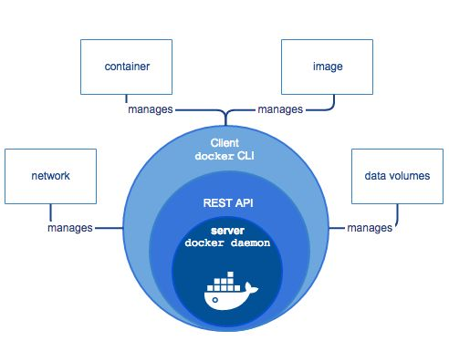

# Images and Containers

*  Container: lightweight virtual machine
*  Image: snapshot of a container

#  Goals

*  using docker to deploy an application
*  also in HPC setting
*  understand different use cases:
    1.  single application, temporary container
    2.  complex application, temporary container
    3.  lightweight Virtual Machine, always-on container

# Container - Reproducibility

*  Reuse existing images with a precise version of OS and software
   *   Docker facilitates this integrating the concept of “reuse if possible” in its core
*  Use a **Dockerfile** file to describe all the steps of creating and configuring a container.
*  Stateless: data are connected but are not part of the application
   *   Docker has Volumes to “contenerize data”
   *   also bound directories

# Architecture


# Image --- Container

**Image** is static, immutable

**Container** is dynamic, mutable

1 container → 1 image

1 image → several containers

#  Simple commands

To start a new container

```
docker run -d -t ubuntu:18.04
``` 

finds the container ID

```
docker ps
``` 

runs a command in the container
```
docker exec suspicious_davinci "ls" "-lpF"
``` 

# docker run

```
docker run  -it ubuntu:18.04
```

**ubuntu**: image

**18.04**: image version (label)


# Dockerizing an application

Different kinds of application:

*   command line program, works on files (rna-seq)
*   long-running server (databases), communicates via network
*   virtual machine (ubuntu)

We will focus on the first type

# Dockerfile 

It is a flow of instructions that describe what software install and how to configure the system.

It is a plain text file called `Dockerfile`

# Dockerfile: base system

[Dockerfile base](base/Dockerfile)

# Dockerfile: rna-seq tools

[Dockerfile for rna-seq](rnaseq/Dockerfile)
